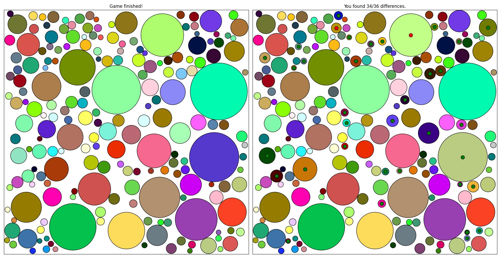

# Spot the difference

This is a little spot the difference game that was born out of my curiousity for matplotlib's
[ginput](https://matplotlib.org/stable/api/_as_gen/matplotlib.pyplot.ginput.html) function.

## To play

Clone the repository, and run `spot_the_diff.py` from your command line.
